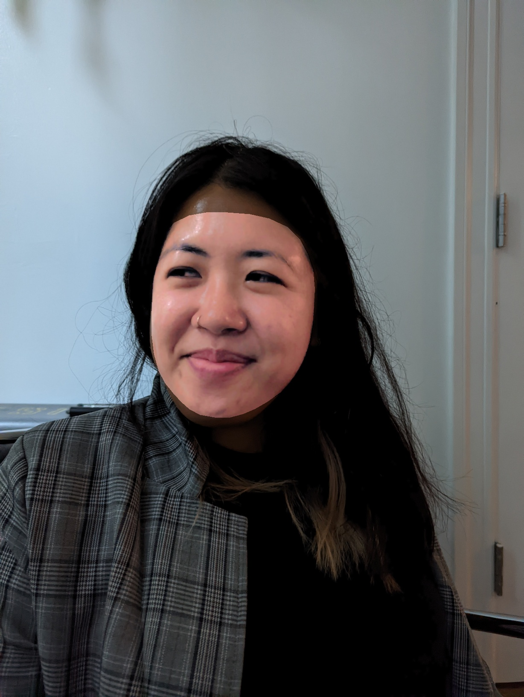
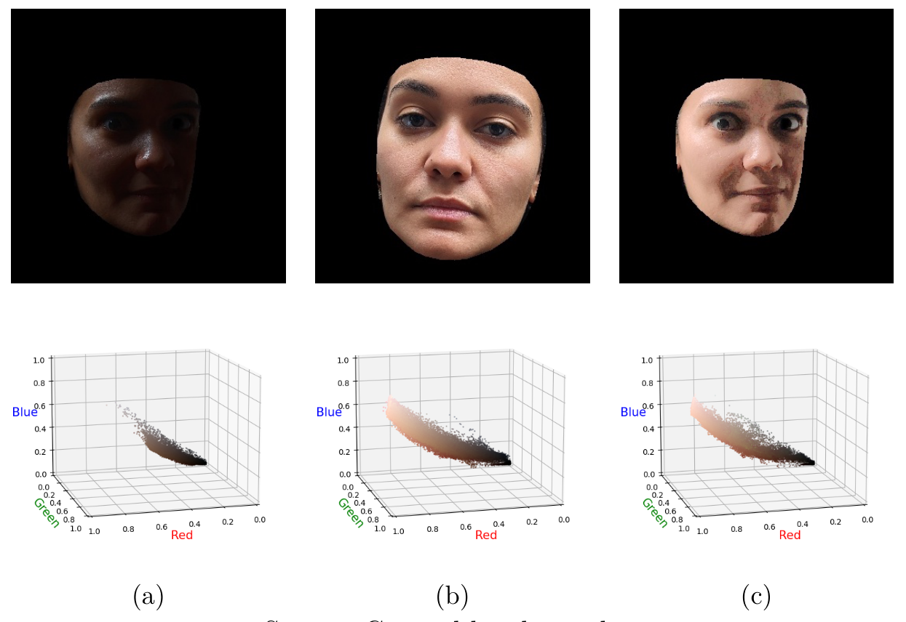

# Skin Color Correction

This repository contains the code develop of a method to correct human facial skin color (white balance) in images that may present considerable variability in color tones. The proposed method is based on the use of an ideally accurate reference image to correct an input image, using image processing concepts.

## Project Overview

The method developed uses facial segmentation, color grading techniques, and bilateral filtering to correct skin tone colors in images while preserving background elements. The approach is inspired by previous works and implemented using Python with the OpenCV and MediaPipe libraries. 

The Figure 1 show an example of application of the proposed color correction method. On the left there is a target image that is used to correct the central input image, resulting in a corrected output image on the left:

  
  
  

Figure 1: Skin color correction.

Initially, the detection and extraction of the regions of interest (ROI) of the human face are performed on the input image (initially with imprecise color) and a target image (considered ideally accurate), using the Mediapipe framework. This framework leverages machine learning models trained to identify regions in an image or video where faces are present. Subsequently, color grading methodologies are applied, transferring the color distributions from the target image to the input image, as shown in Figure 2. Finally, bilateral filtering is applied to the corrected image to remove noise, after which the corrected segmented image is overlaid onto the input image.

  

Figure 2: Color Grading between an input image (a) and a reference image (b), resulting in an image (c) with the correct color grading. The top row shows the face segmentations of the two images, while the bottom row represents the color distributions of the image in the RGB color space.

## Code Structure

The code is organized in a notebook that includes:

1. **Libraries and Helper Functions**: Loading libraries like OpenCV and MediaPipe.
2. **Detection and Extraction of Regions of Interest (ROI)**: Segmenting facial regions in the images.
3. **Color Grading**: Applying techniques to adjust skin tones.
4. **Bilateral Filtering**: Reducing noise while preserving image edges.
5. **Evaluation and Testing**: Visualizing and analyzing the obtained results.

## Contributions

This project was developed as part of a FAPESP scholarship (process nº 2023/15404-1), under the supervision of Prof. João do Espírito Santo Batista Neto, at the Institute of Mathematical and Computational Sciences (USP).

## References

- LUGARESI, C. et al. Mediapipe: A framework for building perception pipelines. *arXiv preprint arXiv:1906.08172*, 2019.

- MONK, E. The monk skin tone scale. *SocArXiv*, 2023.

- PARIS, S. et al. Bilateral filtering: Theory and applications. *Foundations and Trends® in Computer Graphics and Vision*, Now Publishers, Inc., v. 4, n. 1, p. 1–73, 2009.

- PITIé, F.; KOKARAM, A. C.; DAHYOT, R. Automated colour grading using colour distribution transfer. *Computer Vision and Image Understanding*, v. 107, n. 1, p. 123–137, 2007. ISSN 1077-3142. Special issue on color image processing.

- SCHUMANN, C. et al. Consensus and subjectivity of skin tone annotation for ML fairness. *arXiv preprint arXiv:2305.09073*, 2023.

- SHIRAI, K. et al. Guided facial skin color correction. *Signals*, MDPI, v. 2, n. 3, p. 540–558, 2021. 

